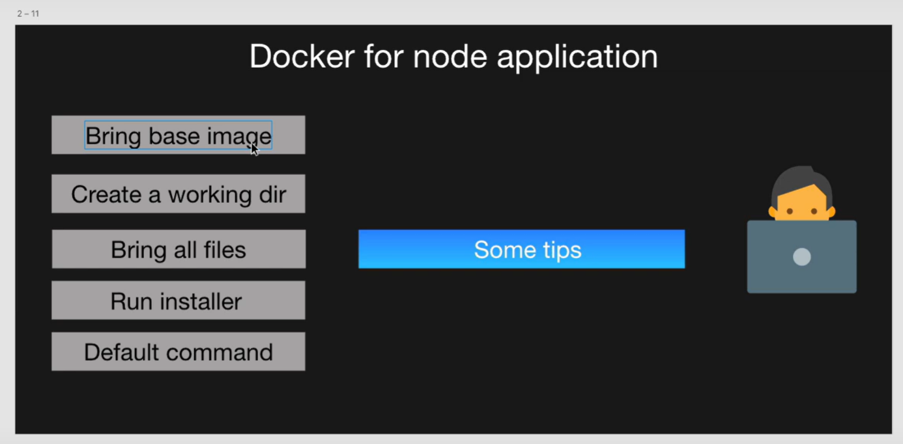

- [YouTube Video Link](https://youtu.be/teGWyCpLNLo?si=_CkTAG9U1pVU9_h3)

- [`node` Docker Image](https://hub.docker.com/_/node)

- Build docker image

    ```sh
    docker build -t <username>/<image-name>:<tag-name> <path-to-docker-file>
    ```

    - Ex-

        ```sh
        docker run satyamseth/nodeapp
        ```


- To run docker image and expose port

    ```sh
    docker run -p <host-port>:<container-port> <image-name> 
    ```

    - Ex-

        ```sh
        docker run -p 8000:8000 satyamseth/nodeapp
        ```

    